在线地址：[https://lecepin.github.io/body-rejuvenation/](https://lecepin.github.io/body-rejuvenation/)

## 起始

**有时在过度劳累之后，腰腿酸痛、精神不振，好像身体被掏空。**

    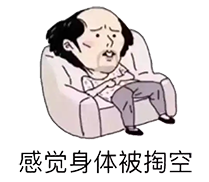

---

作为程序员，身处 996 的加班文化，比同龄人要更易过度消耗身体，你是否有以下特征：

- 疲劳、犯困、睡眠不足
- 易胖
- 免疫力下降、易生病
- 认知功能下降、注意力不集中、记不住事、效率低下
- 情绪不稳定、焦虑、抑郁
- 心率不稳、血压升高
- 性欲降低
- 易老、皮肤松弛、脱发

等等。

---

伟人说过 “**身体是革命的本钱**”，为了降低身体衰退的速度，或者让身体渐渐修复起来，我在这里收集从古至今的物理疗法，让我们的身体 “回春”。

    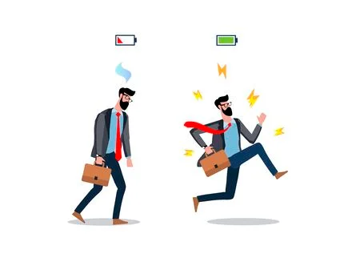

---

## 结构

234

### 文献参考

主要参考以下文献：

| 封面                      | 封面                      | 封面                      | 封面                      |
| ------------------------- | ------------------------- | ------------------------- | ------------------------- |
| 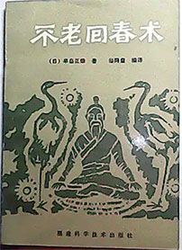  | 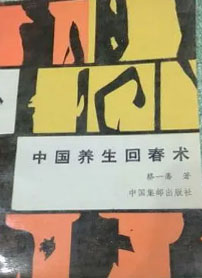  | 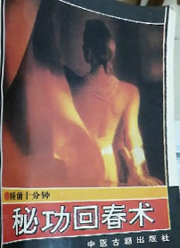  | 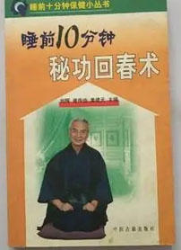  |
| 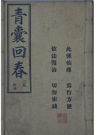  | 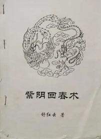  | 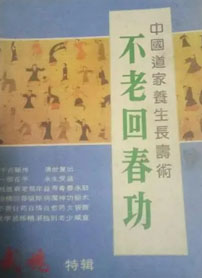  | 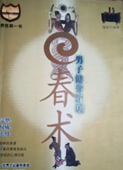 |
| 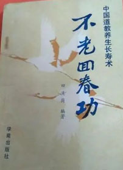 | 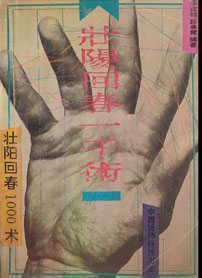 | 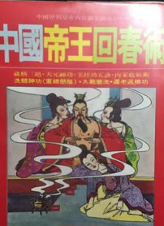 | 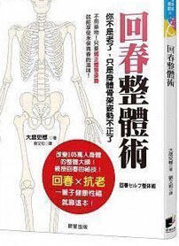 |
| 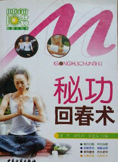 | 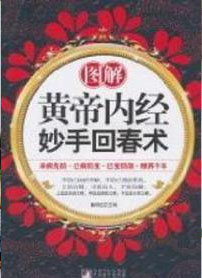 |  | 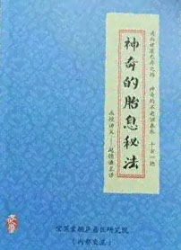 |
| 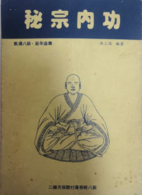 | 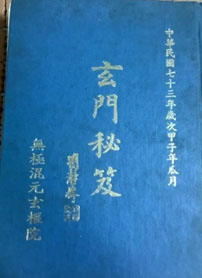 | 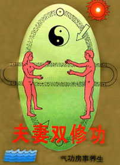 | 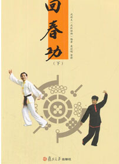 |
| 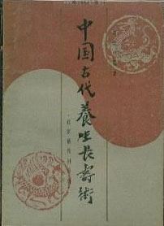 | 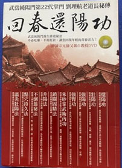 | 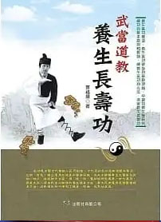 | 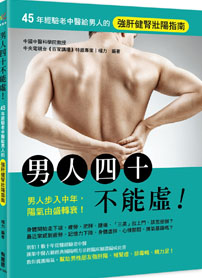 |
| 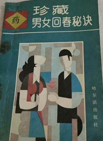 | 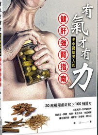 | 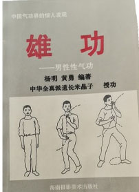 | 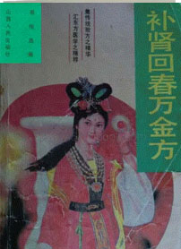 |
