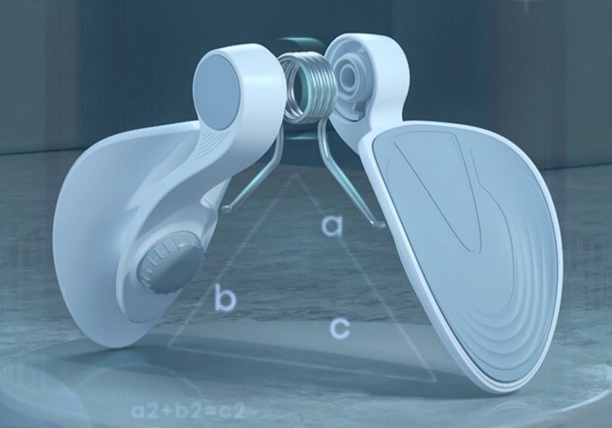

# PC 肌

很多人都听过锻炼 PC 肌、凯格尔运动、提肛运动等，包括憋尿训练，其实说的都是一回事——锻炼 PC 肌。

PC 肌又叫耻骨尾骨肌，准确的说是肌肉群。从身体前方的耻骨开始，到身体后方的尾骨。

男子的 PC 肌是从阴囊到肛门之间的肌肉群，它起着抬起阴茎的辅助作用。

女子的 PC 肌是阴道到肛门之间的肌肉群。

## 作用

- 锻炼 pc 肌，经常收缩肛门，对于肛门括约肌肉，剂血液循环有利。
- 可以预防痔疮，增加男性生殖器的性功能。
- 增强爱爱时的“紧握感”和“充实感”，有高潮体验。
- 生殖系统对病菌控制，阴道自净能力增强，减弱炎症概率。
- 避免尿失禁现象。

## 弱化原因

- 怀孕，导致松弛。
- 久坐，不运动。
- 年龄增长，老化。

## 训练器材

训练器材，多为夹腿动作。

#### 大腿内外侧一体机

#### 大腿内侧夹力器

## 训练视频

下面是一些训练视频，可做参考。

