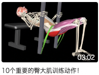
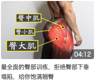
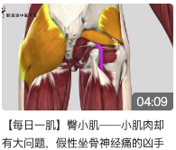
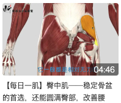
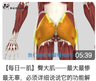
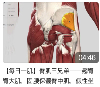

# 臀肌

臀肌属髂肌后群，分为三层。浅层有臀大肌与阔筋膜张肌，前者略呈四边形，是维持人体直立和后伸髋关节的重要肌。在臀大肌与坐骨结节之间有臀大肌坐骨囊，在臀大肌外下 部的腱膜与大转子之间有臀大肌转子囊。臀大肌与深部肌之间为臀大肌下间隙，此间隙的范围与臀大肌的中、外侧部相当，其中充以脂肪、结缔组织和血管神经。此间隙可沿神经血 管经梨状肌上、下孔与盆内相通，下部内侧与坐骨直肠窝的脂肪组织相连，向下沿坐骨神经至股后区，发生感染时可相互蔓延。臀肌中层由上而下依次是臀中肌、梨状肌、上孖肌、 闭孔内肌、下孖肌和股方肌。深层有臀小肌和闭孔外肌。

## 训练视频

下面是一些训练视频，可做参考。

