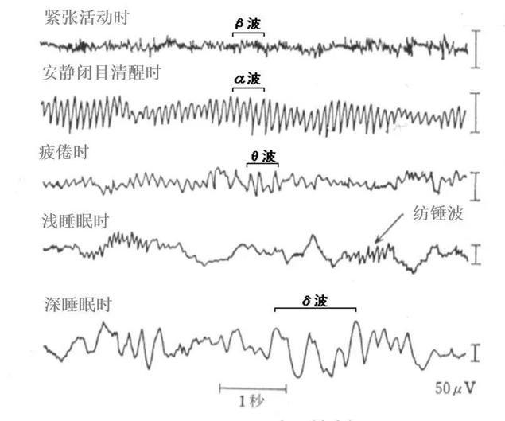
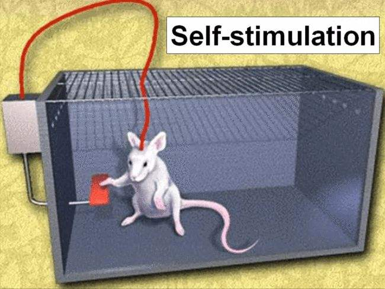

# 睡眠

> 人生的失控，始于不断推迟的睡眠时间。

::: tip
人生大事，好好睡觉。

困了就要睡，不困按时睡。

日出而作，日落而息。
:::

人的一生中有三分之一的时间都在睡觉，睡眠和休息对人体健康至关重要。

睡眠是消除身体疲劳、恢复体力的主要方式，睡眠可以保护大脑、提高记忆力，增强免疫力、康复机体，延缓衰老、促进长寿，保证心理健康等。

## 现状

3 月 19 日在北京发布的一份调查报告显示，中国上班族的每天平均睡眠时长为 7.5 小时，25%的人群睡眠时间不足 6 小时。

- 北上广深最能熬夜 四川上班族起床最晚
- 47%上班族反映睡眠质量不佳

## 睡眠不足的影响

- **心血管发病概率提升**：
  - 睡眠少，冠心病的发病风险就会增加。
- **免疫力下降**：
  - 容易出现了全身炎症的反应，并且引起了疼痛和酸痛感，还可能导致骨质疏松症或自身免疫病，抗体水平低，体虚。
- **癌症风险增加**：
  - 由松果体分泌的褪黑素，是睡眠与癌症之间联系的关键因素。较短的睡眠导致夜间分泌褪黑素的时间较短，而褪黑素是一种反氧化剂，可以帮 DNA 避免或减少损伤。
- **肥胖**：
  - 睡眠中分泌多于清醒的时候，生长激素少，基础代谢就低。还会改变你身体用来调节食欲的激素分泌水平。
- **衰老**：
  - 将导致眼睛变红、黑眼圈加深、皮肤更为暗沉以及出现更多皱纹。数晚的糟糕睡眠会导致身体产生压力激素。这种激素就阻碍胶原蛋白的生成，致使皮肤显得不健康，出现皱纹和黑眼圈。
- **糖尿病风险增加：**
  - 会直接引起某些代谢问题，而这些代谢问题，又会诱发胰岛素抵抗，胰岛素抵抗持续下去，就会导致糖尿病。这就是从睡眠不足到糖尿病的曲折路线，但这条路确实存在。
- **记忆力减退，思维迟钝：**
  - 大脑里面的垃圾，主要是 β 淀粉样蛋白，这种东西沉积在大脑内部，沉积在大脑各个不同区域，就会影响相应位置的脑神经细胞发挥它该有的功能，包括记忆、认知、空间感、语言等。人在进入睡眠后，血液会周期性地大量流出大脑，血液一出去，脑脊液就趁机涌入，把那些淀粉样蛋白给冲掉。
- **沮丧：**

  - 精神分裂症的临床表现包括出现幻觉、妄想和思维混乱等症状，这些也与糟糕的睡眠分不开。有研究表明，大约 70%的患者遭受着不易入睡、睡眠过长或生物钟昼夜颠倒等问题的困扰。

## 褪黑素与血清素

<u>褪黑素是一种诱导自然睡眠的体内激素，它通过调节人的自然睡眠而克服睡眠障碍，提高睡眠质量。</u>它是迄今发现的最强的内源性自由基清除剂。褪黑素的基本功能就是参与抗氧化系统，防止细胞产生氧化损伤。

褪黑素的分泌具有明显的昼夜节律，白天分泌受抑制，晚上分泌活跃。

所以当你在明亮的地方，是不易入睡的。睡觉的时候不要开灯睡，一方面影响你入睡，另一方面影响褪黑素分泌。

有很多研究都显示出血清素、褪黑素对于神经系统有影响，而两者都与光线有关，血清素日出而作，褪黑素日落而行，此消彼长。

在强光照度的天气里，人体血清素转换值明显高于阴暗天。

<u>血清素和褪黑素之间存在转换关系，“日出而作”的血清素，在夜阑人静时就转化为褪黑素。如果血清素浓度不高，晚上褪黑素相应就少了。</u>

所以，首先是帮助产生血清素，间接也提升了褪黑素浓度，增强睡眠效率。

::: tip 小结
白天多晒太阳，晚上早点关灯睡。
:::

## α 波

α 波是连接意识和潜意识的桥梁，是仅有的有效进入潜意识的途径，能够促进灵感的产生，加速信息收集，增强记忆力，是促进学习与思考的最佳脑波。当大脑充满 α 波时，人的意识活动明显受到抑制，无法进行逻辑思维和推理活动。此时，大脑凭直觉、灵感、想象等接收和传递信息。

α 波（8 ～ 12Hz）的下限和 θ 波（4 ～ 8Hz）的上限就是舒曼频率。

可以通过冥想、打坐等方式进入 ~~，或者直接听这个波段的音乐~~。

> ~~睡眠 α 波 →θ 波 →δ 波的超深度睡眠音乐~~
>
> <audio controls><source src="https://gw.alipayobjects.com/mdn/rms_85289e/afts/file/A*JvPhTIsU0xkAAAAAAAAAAAAAARQnAQ" type="audio/mpeg" /></audio>

::: tip 小结
可以通过一些外力作用调节心情，来间接影响脑电波频段，帮助睡眠。
:::

::: warning 注意
脑电波属于电磁波，音乐类的声音波属于机械波。

机械波是无法影响电磁波的，所以共振的更是不存在的。

所以听一些频段的音乐如 α 波睡眠音乐，或者开智音乐，理论上，从共振角度来讲是没有多少作用的。（但如果通过听觉神经，接收到一些可以让你心情平衡的音乐，然后间接影响你的脑电波，可能说的通。）
:::

## 睡的好的标准

睡眠的时长、入睡时间、中间觉醒的次数，也包括睡眠的深度等等。

一般认为半小时之内能够入睡、一晚醒来不超过两次并且醒来后还能很快入睡都属于正常范围。从睡眠时长和节律来看，成年人的睡眠时长在 6-8 个小时，一个夜间经历 3-4 个深睡眠周期也都视作正常。

## 睡眠时间的保障

- 0~3 个月的婴儿的最佳睡眠时长是 14 到 17 小时
- 4~11 个月婴儿的最佳睡眠时长为 12 到 15 小时
- 1~2 岁孩子的最佳睡眠时长为 11 到 14 小时
- 3~5 岁的最佳睡眠时长为 10 到 13 小时
- 6~13 岁孩子的最佳睡眠时长为 9 到 11 小时
- 14~17 岁的最佳睡眠时长为 8 到 10 小时
- 18~25 岁的最佳睡眠时长为 7 到 9 小时
- 26~64 岁的最佳睡眠时长为 7 到 9 小时
- 65 岁以上的最佳睡眠时长为 7 到 8 小时。

::: tip 小结
睡眠时长要保证在 **8 个小时** 左右，当然更重要的是达到睡的好的标准。
:::

## 睡眠时间范围的影响

人体的生物钟在 22 点到 23 点将出现一次低潮，有利于人进入深睡眠状态。故人的最佳上床睡觉时间是 21 点到 22 点。

清晨 6 点左右是生物钟“高潮”的顶峰，此时起床精神最为抖擞。同时，人在这段时间里精力最旺盛，是学习和工作的黄金时间。

若是由于某种原因在 24 时以后还未入睡，就很难入睡。

::: tip 小结
21 点到 22 点为人的最佳上床睡觉时间，清晨 6 点左右为人的最佳起床时间。
:::

## 快速入眠的方法

- 保证全黑环境，让身体可以释放褪黑素，卧室灯光建议柔光或者昏暗的暖光。
- 可以听一些白噪音，来掩盖环境杂音，当然白噪音要一直开者。
- 可以听一些指引性的音乐，让你注意力转移，来加快入眠。
- 不要吃太饱入眠。
- 不要做精神兴奋的事情，如运动等，可以看看书，听听舒缓的音乐。

::: tip 小结
少吃、少动，关灯睡。
:::

## 睡眠姿势

《千金要方》说，春夏的时候要朝东睡，秋冬的时候要朝西睡。

这块仅供参考。

## 反例：为了追求多巴胺而不顾生死

多巴胺的力量，有多强大，曾有这么一个试验：把一个电极植入老鼠的奖励系统，在每次按压开关后，都会产生微弱的电流刺激，老鼠的大脑产生多巴胺。

实验开始后，老鼠不断地按压开关，对身边的食物和异性视若无睹，直到自己完全精疲力竭饿死为止。

::: tip 小结
深夜不睡觉玩手机的你，和这只小白鼠有什么区别呢？

困了就要睡，请放下手机。
:::
